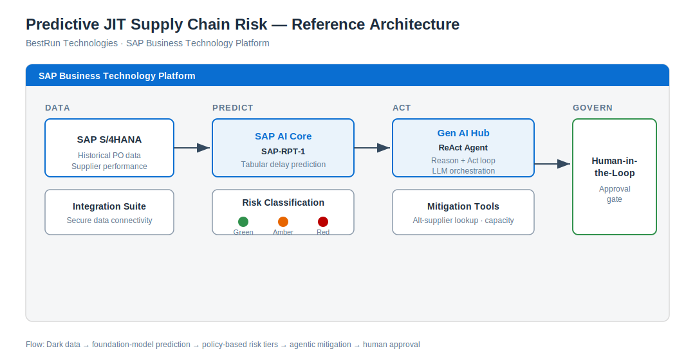

# Predictive JIT Supply Chain Risk with SAP BTP


A hands-on workshop demonstrating how to predict supplier delivery delays using SAP AI Core (SAP-RPT-1) and build agentic mitigation workflows with SAP Gen AI Hub.



> **Note:** Every exercise connects to the **live** SAP-RPT-1 model and, in Exercise 2, the live Gen AI Hub orchestration service. There is no offline or simulated mode — valid SAP AI Core credentials are required to run the notebooks.

## Contents

- [Workshop Overview](#workshop-overview)
- [Business Scenario](#business-scenario)
- [What You'll Build](#what-youll-build)
- [Repository Contents](#repository-contents)
- [Prerequisites](#prerequisites)
- [Running the Workshop](#running-the-workshop)
- [SAP BTP Services Used](#sap-btp-services-used)
- [Troubleshooting](#troubleshooting)
- [License](#license)

## Workshop Overview

**Duration:** ~5 hours (including breaks)

| Part | Duration | Description |
|------|----------|-------------|
| Presentation | 1 hour | Use case, SAP-RPT-1 model, code-based agents |
| Exercise 1A | ~1 hour | Predictive delay scoring with SAP-RPT-1 |
| Exercise 1B (optional) | ~45 min | Model evaluation and open-source baseline benchmarking |
| Exercise 2 | ~1 hour | Agentic mitigation with the ReAct pattern |
| Architecture discussion | 45 min | Production deployment on SAP BTP (delivered as a separate module) |
| Wrap-up | 15 min | Feedback and next steps |

## Business Scenario

**BestRun Technologies** operates a Just-In-Time (JIT) manufacturing model. A delayed shipment of a critical component creates a "line-down" situation costing $15,000+ per hour.

This workshop shows how to:
1. **Predict** which purchase orders are at risk of delay
2. **Classify** risk into actionable tiers (Green/Amber/Red)
3. **Automate** mitigation proposals using AI agents
4. **Govern** decisions with human-in-the-loop approval

## What You'll Build

| Exercise | You'll build | Key SAP capability |
|----------|--------------|--------------------|
| **1A** | A delay-prediction pipeline that scores new purchase orders and maps them to Green/Amber/Red risk tiers with a mitigation proposal | SAP-RPT-1 on SAP AI Core |
| **1B** *(optional)* | A workshop-grade evaluation that compares SAP-RPT-1 against open-source baselines across regression and intervention-risk classification | SAP-RPT-1 + scikit-learn benchmarking |
| **2** | A ReAct agent that reviews high-risk POs, reasons over multiple suppliers, and produces a prioritized mitigation plan behind a human-approval gate | Gen AI Hub orchestration (Claude 4.5 Sonnet) + SAP-RPT-1 |

## Repository Contents

```
├── exercise1a_jit_prediction.ipynb        # Exercise 1A: SAP-RPT-1 prediction
├── exercise1b_jit_model_evaluation.ipynb  # Exercise 1B: evaluation and benchmarking
├── exercise2_jit_agent.ipynb              # Exercise 2: Agentic mitigation
├── .env.example                           # Template for your credentials (copy to .env)
├── assets/
│   └── architecture.svg                   # Reference architecture diagram
└── data/
    ├── historical_po_data.csv             # 600 historical POs with outcomes
    ├── historical_po_data_part1b.csv      # Extended evaluation dataset for Exercise 1B
    ├── new_po_prediction.csv              # Sample PO for prediction
    ├── new_po_prediction_part1b.csv       # Multi-scenario prediction set for Exercise 1B
    └── alt_supplier_table.csv             # Alternative supplier options
```

## Prerequisites

- SAP BTP subaccount with SAP AI Core
- SAP AI Launchpad access
- An active **SAP-RPT-1** deployment (Exercises 1A, 1B, 2) and a **Gen AI Hub orchestration** deployment (Exercise 2)
- Python 3.9+
- Jupyter Notebook environment (e.g., SAP Business Application Studio, VS Code, or JupyterLab)

## Running the Workshop

### 1. Clone and open the project

```bash
git clone <repository-url>
cd 2604_rpt1
```

Open the folder in your Jupyter environment (SAP Business Application Studio, VS Code, or JupyterLab).

### 2. Configure your credentials

Copy the template and fill in the values from your SAP AI Core service key and deployments:

```bash
cp .env.example .env
```

Edit `.env` and provide every value:

| Variable | Used by | Description |
|----------|---------|-------------|
| `AICORE_AUTH_URL` | All | OAuth token endpoint |
| `AICORE_CLIENT_ID` | All | Service-key client ID |
| `AICORE_CLIENT_SECRET` | All | Service-key client secret |
| `AICORE_BASE_URL` | All | AI Core API base URL |
| `AICORE_RESOURCE_GROUP` | All | Your resource group name |
| `RPT1_DEPLOYMENT_URL` | 1A, 1B, 2 | SAP-RPT-1 deployment **base** URL (the notebooks append `/predict`) |
| `ORCH_DEPLOYMENT_URL` | 2 | Gen AI Hub orchestration deployment URL |

Your completed `.env` is git-ignored and must not be committed.

### 3. Install dependencies

Each notebook installs its own dependencies in the first cell (`generative-ai-hub-sdk`, `pandas`, `python-dotenv`, and — for Exercise 1B — `scikit-learn`). Run that cell first, and **restart the kernel** if prompted.

### 4. Run the exercises

Open each notebook and run the cells top to bottom:

1. `exercise1a_jit_prediction.ipynb`
2. `exercise1b_jit_model_evaluation.ipynb` *(optional)*
3. `exercise2_jit_agent.ipynb`

The configuration cell validates your credentials up front. If any required variable is missing, the notebook stops with a clear message instead of continuing with invalid state.

## SAP BTP Services Used

| Service | Purpose |
|---------|---------|
| SAP AI Core | Model hosting and inference runtime |
| SAP-RPT-1 | Tabular prediction for delay risk |
| Gen AI Hub | LLM orchestration (Claude 4.5 Sonnet) |
| Integration Suite | S/4HANA data connectivity (reference architecture) |

## Troubleshooting

| Symptom | Likely cause | Fix |
|---------|--------------|-----|
| `Missing required environment variables` | `.env` missing or incomplete | Copy `.env.example` to `.env`, fill in every key, restart the kernel |
| `401 Unauthorized` | Wrong client ID/secret | Verify `AICORE_CLIENT_ID` and `AICORE_CLIENT_SECRET` against your service key |
| `403 Forbidden` | Wrong resource group | Verify `AICORE_RESOURCE_GROUP` matches your AI Core setup |
| `404` / model not found | Wrong or inactive deployment | Confirm `RPT1_DEPLOYMENT_URL` / `ORCH_DEPLOYMENT_URL` and check the deployment is running in AI Launchpad |
| `429 Too Many Requests` | Rate limiting | The notebooks retry with backoff; wait and re-run if it persists |
| `ModuleNotFoundError` | Dependencies not installed | Run the first cell, then restart the kernel |
| Stale credentials after editing `.env` | Old values cached in kernel | Restart the kernel and re-run the configuration cell |

## License

Apache License 2.0 - See [LICENSE](LICENSE) for details.
