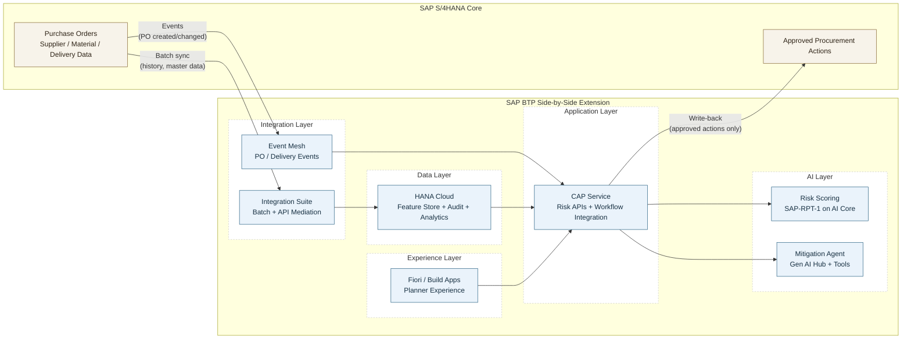
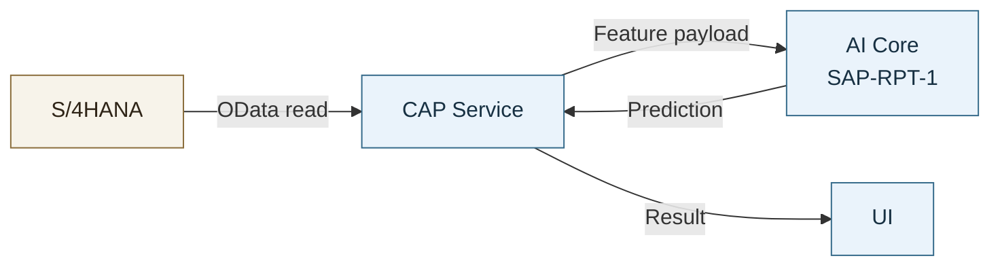
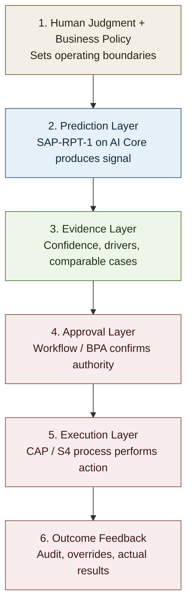
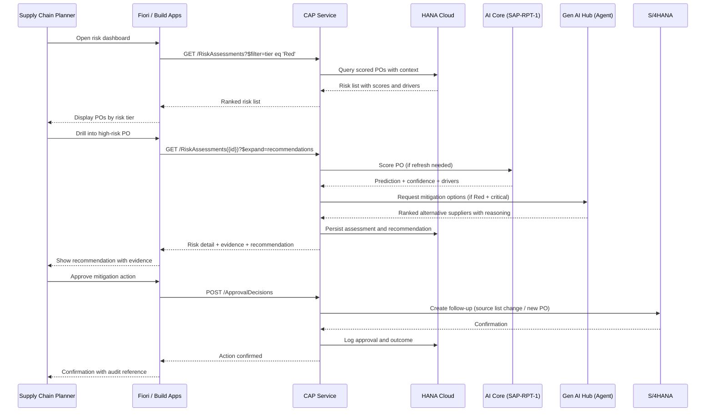
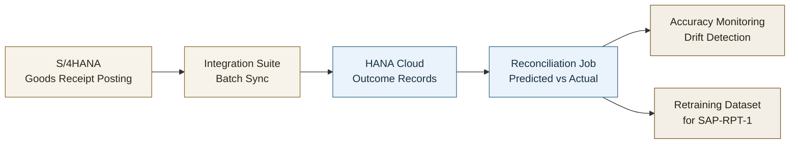

# Predictive JIT Supply Chain with SAP BTP

---

# Part 3: Production Architecture Discussion

**The business problem this architecture solves:** unplanned production downtime caused by supplier delivery failures that weren't anticipated in time to mitigate. The goal is to detect delay risk early enough to act — source alternatively, expedite, or adjust production schedules — before a line-down event occurs. Everything in this architecture exists to support that outcome.

---

This use case should be positioned as a clean-core, side-by-side SAP BTP extension.

- S/4HANA stays the system of record.
- SAP BTP hosts prediction, recommendation, workflow, and decision support.
- HANA Cloud becomes the operational data foundation for production.
- AI remains advisory until a governed business action is approved.

The architectural discussion is not primarily about packaging notebook logic. It is about defining the right boundary between the digital core and the intelligence sidecar.

## 1. Recommended Production Pattern

The recommended enterprise pattern is a **side-by-side SAP BTP extension** where:

- **SAP S/4HANA remains the system of record** for procurement transactions, suppliers, materials, and approved business actions
- **SAP BTP hosts the intelligence sidecar** for data replication, prediction, agentic recommendation, workflow, and user-facing decision support
- **CAP is the application boundary**, not the system of record
- **HANA Cloud becomes the operational data foundation** when persistence, analytics, auditability, and repeatable feature computation are needed

This is a clean-core extension pattern, not an AI feature embedded directly into S/4 custom code.

### 1.1 Core Design Principle

The clean-core stance is:

- Keep **transactional integrity and business ownership** in S/4HANA
- Keep **prediction logic, recommendation logic, and orchestration** on SAP BTP
- Replicate only the data needed for prediction and decision support into the extension layer
- Write back only approved business outcomes, not raw AI internals, unless there is a specific S/4-native reporting requirement that cannot be served from the BTP sidecar, evaluated case by case

### 1.2 Target Solution Architecture

**Reading the diagram:** S/4HANA data flows into BTP via two paths — batch synchronization through Integration Suite for historical context and master data, and event-driven updates through Event Mesh for real-time PO triggers. The write-back path (CAP → Approved Procurement Actions) is the clean-core boundary: only approved business outcomes cross back into S/4.

### 1.3 What Lives Where

| Concern | System of Record |
|---------|------------------|
| Purchase orders, supplier master, material master, confirmations | SAP S/4HANA |
| Replicated historical context for scoring | HANA Cloud sidecar |
| Risk predictions and confidence | BTP sidecar |
| Agent recommendations and reasoning trace | BTP sidecar |
| Approval workflow state | BTP workflow/CAP, optionally mirrored to S/4 via business status |
| Final approved sourcing or procurement action | SAP S/4HANA |

### 1.4 What CAP Does in This Architecture

CAP is described as the "application boundary" and "orchestration and governance boundary." In practice, this means:

- **Owns the sidecar domain model**: entities such as `RiskAssessments`, `MitigationProposals`, and `ApprovalDecisions` are defined in CDS and persisted to HANA Cloud
- **Exposes APIs for the UI**: the Fiori or Build Apps front end consumes OData or REST services served by CAP
- **Orchestrates AI calls**: CAP handlers invoke AI Core for prediction and Gen AI Hub for agent recommendations, then normalize and persist the results
- **Enforces governance**: authorization checks, input validation, and write-back eligibility rules live in the CAP service layer
- **Mediates write-back to S/4**: only after an approval event does CAP trigger the integration flow that updates the ERP process

CAP is not a pass-through proxy. It is the application layer that owns the risk domain on BTP, persists to HANA Cloud, and controls what is allowed to flow back into S/4HANA.

### Discussion Question 1

**If your organization prefers to keep everything in S/4, what are the trade-offs?**

The clean-core position: keep AI outputs in the sidecar, and write back only approved business outcomes or lightweight business references into S/4HANA. Raw predictions, confidence scores, and agent reasoning traces are advisory artifacts — they change frequently, require richer audit storage, and don't belong in ERP tables unless there's a strict reporting requirement that can't be served from BTP.

### 1.5 Write-Back: Recommended Position

This is the key clean-core design decision in the target architecture.

**Recommended default:**

- Keep **predictions, confidence, explanations, and agent proposals outside S/4HANA** in the CAP application and BTP persistence layer
- Write back to S/4HANA only when a **business action has been approved** and must affect the ERP process

**Why this is usually the right design:**

- Raw predictions are advisory artifacts, not authoritative ERP transactions
- Keeping AI artifacts in the sidecar protects S/4 clean-core integrity
- The sidecar needs richer audit, trace, and experimentation storage than most ERP tables should carry
- Model versions and agent traces change more frequently than ERP process design

**Valid write-back patterns:**

| Pattern | When to use it | Recommended? |
|---------|----------------|--------------|
| No write-back; planner works in sidecar UI | Advisory use case, early rollout, low process coupling | Yes, for pilots |
| Write back a status/note/reference ID to S/4 | Business wants ERP visibility of an external assessment | Often useful |
| Write back approved change request or follow-up task | Human approved a sourcing mitigation that must be executed in ERP | Yes |
| Write back raw score, confidence, and full reasoning trace into S/4 tables | Only if there is a strict ERP reporting requirement | Usually no |

### 1.6 When HANA Cloud Is Optional vs Required

HANA Cloud should not be described as generically optional. It is optional only for a narrow architecture shape.

| Situation | HANA Cloud Optional? | Reason |
|-----------|----------------------|--------|
| Single-PO scoring with direct read-through to S/4 and minimal persistence | Yes | CAP can call S/4 APIs and AI Core directly |
| Short-lived demo or workshop with CSV/object storage | Yes | Lightweight prototype mode |
| Need historical context assembly across vendors, materials, and delivery outcomes | No, effectively required | Feature computation and repeatable scoring need a persisted sidecar |
| Need prediction audit trail, recommendation history, analytics, or monitoring | No, effectively required | Operational governance requires structured persistence |
| Need event-driven scaling and decoupled reporting from S/4 | No, effectively required | Sidecar data store avoids overloading transactional APIs |

**Lightweight path (no HANA Cloud):**

In this path, CAP calls S/4 directly for each scoring request, assembles the feature payload, invokes SAP-RPT-1, and returns the result. There is no persistent sidecar — no audit trail, no historical feature store, no feedback loop for accuracy measurement. This works for a demo or narrow pilot but does not scale to production.

For this JIT risk use case, once the solution moves beyond a demo into production, **HANA Cloud is the recommended default**, not merely an optional add-on.

---

## 2. Architecture Decision Guide

| Decision Question | Recommended Pattern | Why |
|------------------|---------------------|-----|
| Is the problem primarily threshold- and policy-driven? | Deterministic rules/workflow | Lowest complexity and highest control |
| Is the input mainly structured ERP/tabular data and output is a risk score? | `sap-rpt-1` prediction on AI Core | Best fit for tabular predictive inference |
| Is adaptive multi-step reasoning needed across tools? | Agentic orchestration with guardrails | Adds value only when workflow is ambiguous |
| Is capability already available in SAP embedded AI/Joule for the same process? | Adopt embedded capability first | Faster time-to-value and lower operational burden |

### Recommended Decision Sequence

1. Start with deterministic process policy.
2. Add `sap-rpt-1` where predictive signal improves outcomes.
3. Introduce agentic orchestration only for decisions that need adaptive reasoning.
4. Keep human approval for any sourcing-impacting action.

> Principle: do not optimize for maximum AI sophistication. Optimize for minimum architecture that reliably delivers business value with clear governance.

### Discussion Question 2

**If prediction already works, what problem is the agent actually solving?**

Architectural guidance: start with prediction plus deterministic policy and workflow. Add an agent only where mitigation requires multi-step reasoning across tools, constraints, and trade-offs.

*Example:* The prediction flags a high-risk PO for a critical material. A deterministic rule could trigger a notification, but choosing the right mitigation requires evaluating alternative suppliers against current inventory positions, contractual lead times, quality certifications, landed cost thresholds, and production schedule constraints — simultaneously. That's the kind of multi-variable, trade-off-weighted decision where an agent adds value over static rules.

### Trust Chain for Adoption

The model contributes predictive signal, but trust comes from evidence, approval, and auditability.

---

## 3. Application Architecture on SAP BTP

### 3.1 Target User Experience

In production, the solution becomes a planner-facing application that does three things well:

- surfaces current PO risk in a business-friendly way
- shows enough evidence for a human to trust or challenge the recommendation
- routes mitigation decisions through explicit approval rather than hidden automation

The application becomes the operational surface where prediction, explanation, recommendation, and approval come together.

### 3.2 Planner Journey

The following sequence illustrates the end-to-end planner experience in the target application:

### 3.3 Recommended BTP Components

| Capability | Recommended BTP Building Block |
|------------|--------------------------------|
| Business UI | SAP Fiori elements or SAP Build Apps |
| Application/API layer | CAP |
| Predictive inference | SAP AI Core with `sap-rpt-1` |
| Agentic recommendation | Gen AI Hub orchestration |
| Identity and authorization | XSUAA |
| Workflow and approval | SAP Build Process Automation or workflow service |

### 3.4 Workflow: BPA vs. CAP-Native Logic

| Consideration | SAP Build Process Automation | CAP-native workflow logic |
|---------------|------------------------------|--------------------------|
| Multi-step approval with escalation | Preferred — visual workflow designer, task inbox, SLA tracking | Possible but requires custom implementation |
| Audit trail and compliance | Built-in process logs and decision history | Must be implemented manually |
| Early pilot with single approver | Heavier than needed | Simpler and faster to build |
| Integration with SAP Task Center | Native | Requires additional configuration |

**Recommended default:** use SAP Build Process Automation for any approval flow that involves multiple steps, role-based routing, or compliance requirements. Use lightweight CAP-native logic only for simple single-approver flows in early pilots where speed of implementation is the priority.

### 3.5 Application Design Principles

- Keep the CAP service as the orchestration and governance boundary
- Separate prediction from recommendation so each can be governed independently
- Present evidence with every high-risk recommendation
- Require human approval for any sourcing-impacting step
- Design for advisory-first rollout, even if later phases add deeper automation

---

## 4. Integration and Data Architecture

### 4.1 Recommended Integration Pattern

The solution needs a governed data flow from S/4HANA into the sidecar so that predictions reflect current operational reality rather than exported snapshots. The cleanest production pattern is a hybrid model:

- use **batch synchronization** for historical context, supplier performance history, and slower-changing reference data
- use **event-driven updates** for new purchase orders, confirmations, and operational triggers that require near real-time scoring

This avoids overloading S/4 with repeated read-through queries while still allowing timely decisions on newly created or updated POs.

### 4.2 Event-Driven Scoring Architecture

```mermaid
flowchart LR
   S4["S/4HANA<br/>PO Created"] --> EM["SAP Event Mesh<br/>Topic"]
   EM --> CAP["CAP Service<br/>Event Handler"]
   CAP --> RS["Risk Scoring<br/>SAP-RPT-1"]
   RS --> HC["HANA Cloud<br/>Persist Score + Audit"]
   HC --> AG["If Red + Critical<br/>Agent Flow"]
   AG --> NT["Notification<br/>to SC Manager"]

   classDef source fill:#f7f3ea,stroke:#8a6d3b,color:#2f2417,stroke-width:1px;
   classDef app fill:#eaf3fb,stroke:#356a8a,color:#173042,stroke-width:1px;
   classDef action fill:#edf6ed,stroke:#4d7a4d,color:#183218,stroke-width:1px;

   class S4,EM source;
   class CAP,RS,HC app;
   class AG,NT action;
```

Every prediction is persisted to HANA Cloud before downstream processing. This ensures auditability regardless of whether the agent flow triggers.

### Discussion Question 3

**When is direct read-through from S/4 good enough, and when does it become the wrong design?**

Architectural guidance: direct read-through can work for a narrow pilot, but production-grade prediction, audit, analytics, and repeatable context assembly typically require HANA Cloud as the sidecar persistence layer.

### 4.3 Trade-offs Discussion

| Decision | Option A | Option B | Recommendation |
|----------|----------|----------|----------------|
| **Data sync** | Batch (daily) | Event-driven | Event for POs; Batch for master data |
| **S/4 access** | Direct OData | Integration Suite | Integration Suite for production |
| **Context storage** | In-memory | HANA Cloud | HANA Cloud for persistence + analytics |
| **Scoring trigger** | Scheduled batch | On PO creation | Event-driven for critical; Batch for bulk |

**Why Integration Suite over direct OData for production:** Direct OData calls from CAP to S/4HANA work for a pilot, but Integration Suite adds API throttling and rate limiting to protect S/4 transactional performance, centralized credential and certificate management, transformation and mapping when the S/4 API shape does not match the sidecar model, and monitoring and alerting on integration failures. For a production side-by-side extension, these concerns outweigh the simplicity of direct calls.

### 4.4 HANA Cloud Decision

> This section consolidates the HANA Cloud guidance introduced in Section 1.6 and referenced in Discussion Question 3. The position is intentionally repeated because under-investing in sidecar persistence is the most common architectural gap in these solutions.

For this use case, HANA Cloud becomes the recommended default once the solution needs any combination of:

- historical feature assembly across suppliers, materials, and delivery outcomes
- auditability of predictions and recommendations
- operational analytics and monitoring
- decoupled scaling from transactional S/4 APIs

If the goal is only a narrow pilot for single-PO scoring, a lighter design may be acceptable. For a production side-by-side extension, HANA Cloud is usually the correct architectural choice.

### 4.5 Prediction Feedback Loop

The architecture must close the loop between predictions and actual outcomes. Without this, model quality silently degrades over time as supplier behavior, lead times, and procurement patterns shift.

**How actuals flow back:**

- A scheduled batch job reconciles predicted delivery dates against actual goods receipt (GR) postings in S/4HANA
- The reconciliation result — predicted delay vs. actual delay — is written to HANA Cloud alongside the original prediction record
- This creates a paired dataset (prediction + outcome) that supports accuracy monitoring and retraining

**What this enables:**

- Continuous measurement of prediction accuracy (the basis for the >80% target in Section 5.2)
- Detection of model drift — when accuracy drops below threshold, the operations team is alerted
- Retraining dataset assembly — outcome-labeled records are available for periodic SAP-RPT-1 retraining or recalibration
- Override analysis — comparing overridden predictions to actual outcomes reveals whether human judgment improved or degraded decision quality

Without this feedback loop, the system can generate predictions indefinitely but has no mechanism to know whether they are still accurate. This is one of the first capabilities to build once the solution moves beyond a pilot.

---

## 5. Operating Model

### 5.1 Operational Priorities

Production readiness depends less on code volume and more on governance discipline:

- secure access to S/4, BTP services, and approval roles
- persistent audit of predictions, overrides, and approved actions
- observability for latency, failures, and model quality over time
- a controlled rollout that proves trust before scaling automation

### 5.2 Success Metrics

| Metric | Target | Measurement | Measured By |
|--------|--------|-------------|-------------|
| **Prediction Accuracy** | >80% of scored POs have predicted delivery within ±1 day of actual | (Predictions within ±1 day) / (Total scored POs with known outcomes) | HANA Cloud reconciliation job (Section 4.5) |
| **Risk Detection Rate** | >90% Red-tier caught | True positives / actual delays | HANA Cloud reconciliation job |
| **Mitigation Adoption** | >60% proposals approved | Approved / Generated | CAP audit log + Workflow/BPA |
| **Recommendation Override Rate** | Track by persona and supplier segment | Overrides / total recommendations | CAP audit log |
| **Override Reason Coverage** | >90% overrides coded with reason | Overrides with reason / all overrides | CAP audit log |
| **Time to Detection** | <4 hours from PO creation | Event timestamp to alert | Event Mesh + CAP event handler SLA |
| **Line-Down Avoidance** | Track avoided incidents | Mitigated POs that would have delayed | HANA Cloud analytics + S/4 production data |

**Note on Line-Down Avoidance:** This metric requires a counterfactual — "would this PO have caused a line-down if not mitigated?" — which cannot be directly measured. In practice, this is estimated by comparing mitigated high-risk POs against historical line-down rates for similar unmitigated cases, or by tracking near-miss incidents where mitigation was confirmed to prevent disruption. Treat this as a lagging indicator that requires operational judgment, not a precise KPI.

### 5.3 Governance and Decision Rights

| Layer | Responsibility | Typical Technology | Authority Level |
|------|----------------|--------------------|-----------------|
| Prediction layer | Generate risk scores | AI Core + `sap-rpt-1` | Advisory |
| Policy layer | Translate score into action band | CAP service/business rules | Advisory with controls |
| Agent layer | Propose mitigation options | Gen AI Hub orchestration + tools | Recommendation only |
| Approval layer | Accept/reject sourcing-impacting decision | Workflow/BPA + approver role | Authoritative |
| Execution layer | Perform ERP process change | S/4-integrated app/service | Post-approval only |

### 5.4 Suggested Rollout Logic

The most defensible rollout path is:

1. start with advisory prediction
2. add decision evidence and human approval
3. introduce agentic mitigation only for the subset of cases where static rules are insufficient
4. write back approved actions into S/4 only after the operating model is trusted

### 5.5 Security and Data Governance (Out of Scope)

This workshop focuses on functional architecture, not security architecture. However, production implementations must address:

- **Data classification:** Supplier performance data, pricing, and lead times may be commercially sensitive. Classify data appropriately and enforce access controls in both HANA Cloud and CAP.
- **Data residency:** For multinational deployments, determine where prediction and audit data may be stored and processed. BTP region selection and HANA Cloud instance placement matter.
- **Cross-boundary data flow:** The S/4-to-BTP replication introduces a data boundary. Ensure the integration pattern complies with any internal data governance policies.
- **LLM data handling:** If the agent layer uses Gen AI Hub with external model providers, understand what data is sent to the model and whether it leaves the SAP trust boundary.

These considerations are production requirements, not workshop scope. Flag them early in any client engagement.

---

## Final Guidance

### Key Architecture Principles

1. **AI is a capability, not the architecture** — Embed AI into a governed extension pattern
2. **Observability by design** — Log every prediction and agent step
3. **Human-in-the-loop for action** — Recommend, don't execute autonomously
4. **Trust is designed, not assumed** — Evidence, approval paths, and auditability matter as much as model quality
5. **Data freshness matters** — Stale data leads to weak decisions
6. **Start with the business outcome** — "$X avoided downtime" beats "N predictions made"

---

*This architecture guide is intended as a participant-facing reference for the recommended production architecture behind the use case.*
