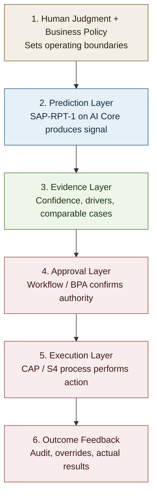
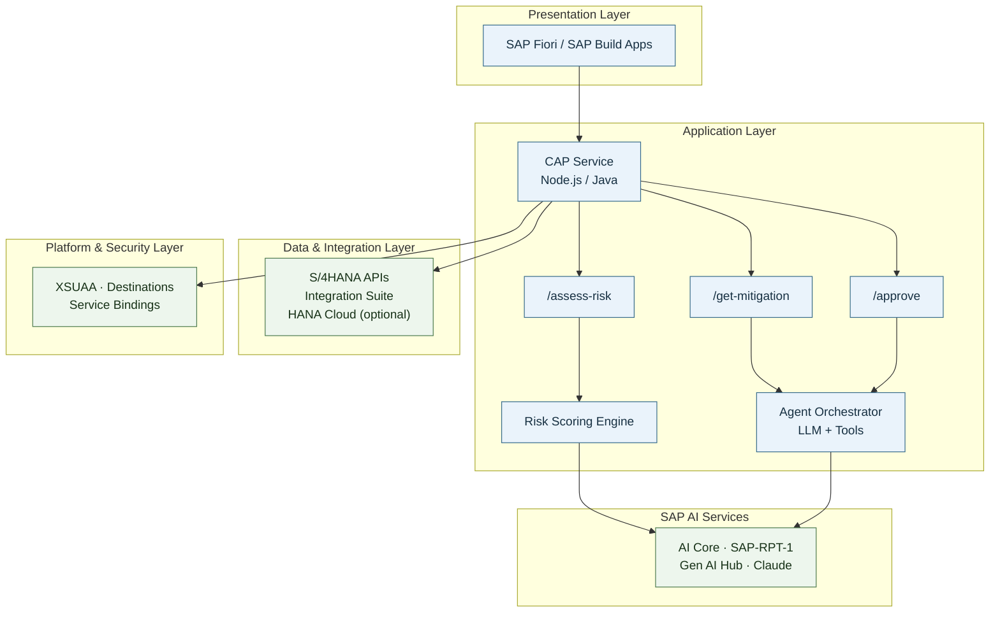
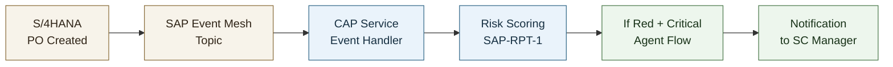

# Predictive JIT Supply Chain with SAP BTP

> **Session overview**
>
> | Part | Format | What you will do |
> |------|--------|------------------|
> | **Part 1 — Hands-On Exercise** | Self-paced | Build predictive delay scoring with SAP-RPT-1 |
> | **Part 2 — Hands-On Exercise** | Self-paced | Extend to agentic mitigation with ReAct pattern |
> | **Part 3 — Architecture Discussion** | Presenter-led | Walk through production architecture patterns for JIT risk management on SAP BTP |

---

# Part 3: Architecture Discussion (Presenter-Led)

> **Note for participants:** The sections below are **not hands-on steps**. Your instructor will walk through these topics as a guided discussion. You can follow along and refer back to this document after the session.

## Contents

| Scenario | Description | Audience |
|----------|-------------|----------|
| **A** | From Notebook to Production CAP Application | Developers + Architects |
| **B** | End-to-End Data Integration from SAP S/4HANA | Integration Specialists |
| **C** | HANA Cloud as the Prediction Data Store | Data Engineers |
| **D** | Go-Live Checklist and Operational Excellence | All |

---


## Architecture Decision Guide: Rule, Predict, Agent, or Embedded AI

This workshop separates architecture choices that are often mixed together in enterprise programs, so solution architects can design by intent rather than by tooling preference.

| Decision Question | Recommended Pattern | Why |
|------------------|---------------------|-----|
| Is the problem primarily threshold- and policy-driven? | Deterministic rules/workflow | Lowest complexity and highest control |
| Is the input mainly structured ERP/tabular data and output is a risk score? | `sap-rpt-1` prediction on AI Core | Best fit for tabular predictive inference |
| Is adaptive multi-step reasoning needed across tools? | Agentic orchestration with guardrails | Adds value only when workflow is ambiguous |
| Is capability already available in SAP embedded AI/Joule for the same process? | Adopt embedded capability first | Faster time-to-value and lower operational burden |

### Recommended Decision Sequence for Architects and Developers

1. Start with deterministic process policy.
2. Add `sap-rpt-1` where predictive signal improves outcomes.
3. Introduce agentic orchestration only for decisions that need adaptive reasoning.
4. Keep human approval for any sourcing-impacting action.

> Principle: do not optimize for maximum AI sophistication. Optimize for minimum architecture that reliably delivers business value with clear governance.

## Human Adoption as an Architecture Constraint

In enterprise AI programs, the binding constraint is often not deployment complexity but trust. A BTP workshop can teach a developer how to deploy `sap-rpt-1` on AI Core, but it does not by itself persuade a planner, buyer, or procurement manager to rely on a prediction over established operating judgment.

This does not make the challenge non-technical. It means the architecture must be designed to reduce perceived risk, preserve accountability, and make AI-assisted decisions inspectable.

### What users are actually evaluating

- Is this recommendation understandable enough to act on?
- If the prediction is wrong, who is accountable?
- Can I override it without losing control of the process?
- Has this system earned trust through visible outcomes over time?

### Architecture implications for SAP BTP solutions

- Keep AI outputs advisory before they become operationally binding
- Show evidence, not just a score: confidence, relevant historical patterns, and policy rationale
- Preserve decision rights with workflow-based approval for sourcing-impacting actions
- Log predictions, context, and outcomes so the business can inspect and challenge the system
- Roll out in phases so users calibrate trust through pilot results rather than executive mandate

> Design principle: if the business experiences the solution as a black box, adoption will stall even when model accuracy is acceptable. Trust must be designed into the architecture, workflow, and user experience.

### Trust Chain for BTP AI Adoption



The model contributes predictive signal, but business trust is created by the full chain around it.

---

## Scenario A: From Notebook to Production CAP Application

### Use Case A: Production-Grade JIT Risk Dashboard

**Business situation:** The supply chain team needs a governed, always-on system that continuously scores incoming POs for delay risk. They cannot rely on ad-hoc notebook execution or manual monitoring.

**Why this use case matters:**
- Production line efficiency depends on proactive risk detection
- Business users need a simple dashboard, not Python notebooks
- Audit trail and approval workflows are required for compliance

**What the end users need:**
- A Fiori-style application showing current PO risk status
- Visible decision evidence such as confidence, key risk drivers, and comparable historical cases
- Automatic alerts when Red-tier risks are detected
- One-click access to mitigation proposals
- Approval workflow before sourcing changes are executed

In trust-sensitive processes, this dashboard is not just a monitoring surface. It is the user-facing implementation of the Evidence Layer: the place where the business can inspect why the system is recommending action before deciding whether to approve it.

### Notebook → Production: What Changes?

| Concern | Notebook (Today) | Production (Target) |
|---------|------------------|---------------------|
| **User interface** | Code cells | Fiori / SAP Build Apps |
| **Authentication** | `.env` file | XSUAA + service bindings |
| **Data freshness** | Static CSV files | Live S/4HANA integration |
| **Model inference** | Manual trigger | Event-driven or scheduled |
| **Observability** | Print statements | Structured logging + dashboards |
| **Approval workflow** | Console input | BTP Workflow / Build Process Automation |
| **Error handling** | Exceptions | Retry policies, dead-letter queues |
| **Scalability** | Single user | Multi-tenant CAP deployment |

> **Important:**
> The code snippets in this scenario are **illustrative only**. They demonstrate patterns, not runnable implementations.

### A.1 Target Solution Architecture (High Level)



**SAP BTP value mapping:**
- **CAP** gives standard service APIs, security integration, and extension-ready app model
- **AI Core** provides managed AI runtime with SAP-RPT-1 and LLM access
- **Gen AI Hub SDK** enables consistent orchestration patterns
- **Integration Suite** connects to live ERP data

### A.2 Recommended Build Steps (CAP Productization)

1. **Create CAP service APIs:**
   - `POST /api/assess-po-risk` - Score a single PO
   - `POST /api/batch-assess` - Score multiple POs
   - `GET /api/risk-dashboard` - Current risk status
   - `POST /api/generate-mitigation` - Create proposal
   - `POST /api/approve-mitigation` - Approval endpoint

2. **Implement a risk scoring service:**
   - Wrap SAP-RPT-1 inference calls
   - Cache historical context for efficiency
   - Return standardized risk tier + confidence

3. **Add governance controls:**
   - Persist all predictions with timestamps
   - Log agent reasoning traces
   - Require approval for sourcing changes

4. **Add enterprise security:**
   - XSUAA scopes for viewer vs approver personas
   - Secure secrets via service bindings
   - Audit log all decisions

5. **Add operational quality:**
   - Structured logs to SAP Cloud Logging
   - Alert on high-risk PO spikes
   - Dashboard for model accuracy metrics

### A.3 CAP Sample Code (Illustrative)

```javascript
// srv/risk-service.js (illustrative only)
const cds = require('@sap/cds');

module.exports = cds.service.impl(async function () {
  
  this.on('assessPORisk', async (req) => {
    const { poId } = req.data;
    
    // Fetch PO details from S/4HANA
    const poDetails = await fetchPOFromS4(poId);
    
    // Get historical context
    const historicalContext = await getHistoricalPOContext(poDetails.vendorId);
    
    // Call SAP-RPT-1 for prediction
    const prediction = await callRPT1Model(poDetails, historicalContext);
    
    // Apply business policy
    const riskTier = deriveRiskTier(prediction.delayDays);
    
    // Persist for audit
    await persistPrediction(poId, prediction, riskTier);
    
    return {
      poId,
      predictedDelay: prediction.delayDays,
      riskTier,
      recommendation: getRiskRecommendation(riskTier, poDetails.isCritical)
    };
  });

  this.on('generateMitigation', async (req) => {
    const { poId, riskAssessment } = req.data;
    
    // Only for high-risk scenarios
    if (riskAssessment.riskTier !== 'Red') {
      return { status: 'NOT_REQUIRED' };
    }
    
    // Run agent for mitigation proposal
    const agentResult = await runMitigationAgent(poId, riskAssessment);
    
    // Persist proposal
    const proposalId = await persistProposal(agentResult);
    
    return {
      proposalId,
      status: 'PENDING_APPROVAL',
      recommendation: agentResult.recommendation,
      alternativeVendor: agentResult.suggestedVendor
    };
  });
});
```

### A.4 AI Service Integration Layer

```javascript
// srv/lib/ai-service.js (illustrative only)
const { OrchestrationService } = require('gen_ai_hub.orchestration');

async function callRPT1Model(poDetails, historicalContext) {
  // Format data for SAP-RPT-1
  const payload = formatForRPT1(poDetails, historicalContext);
  
  // Call AI Core deployment
  const response = await aiCoreClient.predict(
    process.env.RPT1_DEPLOYMENT_URL,
    { input: payload }
  );
  
  return {
    delayDays: response.prediction,
    confidence: response.confidence
  };
}

async function runMitigationAgent(poId, riskAssessment) {
  const orchestration = new OrchestrationService({
    apiUrl: process.env.ORCH_DEPLOYMENT_URL
  });
  
  // Agent with tools for supplier lookup, capacity check, etc.
  const result = await orchestration.run({
    template: agentTemplate,
    llm: { name: 'anthropic--claude-4.5-sonnet' },
    context: { poId, riskAssessment }
  });
  
  return parseAgentResult(result);
}
```

### A.5 Deployment Steps (CAP + AI Services)

1. **Provision or bind services:**
   - SAP AI Core (for RPT-1 and LLM access)
   - XSUAA (authentication)
   - Destination Service (for S/4HANA connectivity)
   - SAP HANA Cloud (optional, for persistence)

2. **Configure environment:**
   - Bind service keys
   - Set deployment URLs for AI models
   - Configure destination to S/4HANA

3. **Build and deploy:**
   ```bash
   # Build MTA archive
   mbt build
   
   # Deploy to Cloud Foundry
   cf deploy mta_archives/jit-risk-app.mtar
   ```

4. **Post-deployment verification:**
   - Health endpoint check
   - Test single PO risk assessment
   - Verify agent produces valid proposals
   - Confirm approval workflow triggers

---

## Scenario B: End-to-End Data Integration from SAP S/4HANA

### Use Case B: Live ERP Data for Accurate Predictions

**Business situation:** The workshop used static CSV files exported from S/4HANA. In production, predictions must use current data—vendor performance changes, new POs arrive continuously, and historical patterns evolve.

**Why this use case matters:**
- Stale data leads to inaccurate predictions
- Manual data exports don't scale
- Enterprise teams need governed integration

**What the business needs:**
- Automatic data pipeline from S/4HANA to prediction service
- Near real-time updates for critical attributes
- Clear data freshness SLAs

### B.1 Data Sources in S/4HANA

| Data Element | S/4HANA Source | Update Frequency |
|--------------|----------------|------------------|
| Purchase Orders | EKKO/EKPO (OData: `A_PurchaseOrder`) | Real-time |
| Vendor Master | LFA1 (OData: `A_Supplier`) | Daily |
| Material Master | MARA (OData: `A_Product`) | Weekly |
| Delivery History | LIKP/LIPS (OData: `A_InbDeliveryHeader`) | Real-time |
| Quality Notifications | QMEL (OData: `A_DefectRecord`) | Daily |

### B.2 Integration Patterns

**Pattern 1: Scheduled Batch Synchronization**
- Best for: Historical context, vendor profiles, material master
- Frequency: Daily or weekly
- Implementation: Integration Suite iFlow → HANA Cloud or Object Store

```text
S/4HANA (OData)
   │ (scheduled extraction)
   v
Integration Suite iFlow
   │ (transform + validate)
   v
HANA Cloud / Object Store
   │
   v
Prediction Service reads from cache
```

**Pattern 2: Event-Driven Real-Time Updates**
- Best for: New PO creation, delivery confirmations
- Frequency: Near real-time (seconds to minutes)
- Implementation: S/4HANA Business Events → Event Mesh → CAP Service

```text
S/4HANA
   │ (Business Event: PO Created)
   v
SAP Event Mesh
   │ (pub/sub)
   v
CAP Service Event Handler
   │ (trigger risk assessment)
   v
Risk Dashboard Updated
```

### B.3 Integration Flow Example (Illustrative)

```groovy
// Integration Suite iFlow script (illustrative only)
// Extracts vendor performance metrics from S/4HANA

def message = bodyAs(String.class)
def vendors = parseVendorData(message)

vendors.each { vendor ->
    // Calculate OTIF from delivery history
    def deliveries = getDeliveryHistory(vendor.vendorId)
    def otifPercent = calculateOTIF(deliveries)
    def avgDelay = calculateAvgDelay(deliveries)
    
    vendor.otifPercent = otifPercent
    vendor.avgPastDelay = avgDelay
    vendor.lastUpdated = now()
}

// Output to HANA Cloud or Object Store
message.setBody(toJSON(vendors))
message.setHeader('targetTable', 'VENDOR_PERFORMANCE')
return message
```

### B.4 Event-Driven Scoring Architecture



### B.5 Trade-offs Discussion

| Decision | Option A | Option B | Recommendation |
|----------|----------|----------|----------------|
| **Data sync** | Batch (daily) | Event-driven | Event for POs; Batch for master data |
| **S/4 access** | Direct OData | Integration Suite | Integration Suite for production |
| **Context storage** | In-memory | HANA Cloud | HANA Cloud for persistence + analytics |
| **Scoring trigger** | Scheduled batch | On PO creation | Event-driven for critical; Batch for bulk |

---

## Scenario C: HANA Cloud as the Prediction Data Store

### Use Case C: Scalable Context Management

**Business situation:** SAP-RPT-1 performs better with rich historical context. As PO volume grows, managing context efficiently becomes critical.

**Why HANA Cloud:**
- Native integration with BTP services
- Vector capabilities for future ML enhancements
- Enterprise-grade performance and security
- Single source of truth for analytics + ML

### C.1 Data Model for Prediction Context

```sql
-- Historical PO Performance (for SAP-RPT-1 context)
CREATE TABLE PO_HISTORY (
    PO_ID NVARCHAR(20) PRIMARY KEY,
    VENDOR_ID NVARCHAR(10),
    MATERIAL_ID NVARCHAR(18),
    ORDER_QUANTITY INTEGER,
    ORDER_DATE DATE,
    PLANNED_DELIVERY_DATE DATE,
    ACTUAL_DELIVERY_DATE DATE,
    ACTUAL_DELAY_DAYS DECIMAL(5,1),
    CREATED_AT TIMESTAMP DEFAULT CURRENT_TIMESTAMP
);

-- Vendor Performance Metrics (derived)
CREATE TABLE VENDOR_PERFORMANCE (
    VENDOR_ID NVARCHAR(10) PRIMARY KEY,
    VENDOR_COUNTRY NVARCHAR(50),
    OTIF_PERCENT DECIMAL(5,2),
    AVG_DELAY_DAYS DECIMAL(5,2),
    TOTAL_POS INTEGER,
    LAST_UPDATED TIMESTAMP
);

-- Risk Predictions (audit trail)
CREATE TABLE RISK_PREDICTIONS (
    PREDICTION_ID NVARCHAR(36) PRIMARY KEY,
    PO_ID NVARCHAR(20),
    PREDICTED_DELAY DECIMAL(5,1),
    RISK_TIER NVARCHAR(10),
    CONFIDENCE DECIMAL(3,2),
    MODEL_VERSION NVARCHAR(20),
    PREDICTED_AT TIMESTAMP DEFAULT CURRENT_TIMESTAMP
);

-- Mitigation Proposals
CREATE TABLE MITIGATION_PROPOSALS (
    PROPOSAL_ID NVARCHAR(36) PRIMARY KEY,
    PO_ID NVARCHAR(20),
    CURRENT_VENDOR NVARCHAR(10),
    RECOMMENDED_VENDOR NVARCHAR(10),
    STATUS NVARCHAR(20), -- PENDING, APPROVED, REJECTED
    JUSTIFICATION NCLOB,
    CREATED_AT TIMESTAMP,
    DECIDED_AT TIMESTAMP,
    DECIDED_BY NVARCHAR(100)
);
```

### C.2 Context Query for SAP-RPT-1

```sql
-- Get historical context for a prediction
SELECT 
    PO_ID,
    VENDOR_ID,
    VP.VENDOR_COUNTRY,
    VP.OTIF_PERCENT AS VENDOR_OTIF_PERCENT,
    VP.AVG_DELAY_DAYS AS VENDOR_AVG_PAST_DELAY,
    MATERIAL_ID,
    ORDER_QUANTITY,
    EXTRACT(MONTH FROM ORDER_DATE) AS ORDER_MONTH,
    ACTUAL_DELAY_DAYS
FROM PO_HISTORY PH
JOIN VENDOR_PERFORMANCE VP ON PH.VENDOR_ID = VP.VENDOR_ID
WHERE PH.VENDOR_ID = :targetVendor
   OR PH.MATERIAL_ID = :targetMaterial
ORDER BY ORDER_DATE DESC
LIMIT 200;
```

### C.3 Analytics Dashboard Queries

```sql
-- Weekly risk distribution
SELECT 
    RISK_TIER,
    COUNT(*) AS PO_COUNT,
    AVG(PREDICTED_DELAY) AS AVG_PREDICTED_DELAY
FROM RISK_PREDICTIONS
WHERE PREDICTED_AT >= ADD_DAYS(CURRENT_DATE, -7)
GROUP BY RISK_TIER;

-- Vendor risk ranking
SELECT 
    VENDOR_ID,
    COUNT(CASE WHEN RISK_TIER = 'Red' THEN 1 END) AS RED_COUNT,
    COUNT(CASE WHEN RISK_TIER = 'Amber' THEN 1 END) AS AMBER_COUNT,
    COUNT(*) AS TOTAL_POS
FROM RISK_PREDICTIONS RP
JOIN PO_HISTORY PH ON RP.PO_ID = PH.PO_ID
WHERE RP.PREDICTED_AT >= ADD_DAYS(CURRENT_DATE, -30)
GROUP BY VENDOR_ID
ORDER BY RED_COUNT DESC;

-- Mitigation effectiveness
SELECT 
    MP.RECOMMENDED_VENDOR,
    COUNT(*) AS PROPOSALS,
    SUM(CASE WHEN MP.STATUS = 'APPROVED' THEN 1 ELSE 0 END) AS APPROVED,
    AVG(CASE WHEN MP.STATUS = 'APPROVED' 
        THEN DATEDIFF(DAY, PH.PLANNED_DELIVERY_DATE, PH.ACTUAL_DELIVERY_DATE)
        END) AS AVG_ACTUAL_DELAY_AFTER_SWITCH
FROM MITIGATION_PROPOSALS MP
JOIN PO_HISTORY PH ON MP.PO_ID = PH.PO_ID
GROUP BY MP.RECOMMENDED_VENDOR;
```

---

## Scenario D: Go-Live Checklist and Operational Excellence

### D.1 Security Checklist

| Area | Requirement | BTP Implementation |
|------|-------------|-------------------|
| **API Authentication** | Only authorized callers | XSUAA + OAuth2 |
| **Credential Storage** | No secrets in code | BTP Credential Store |
| **Data Privacy** | PII handling compliance | Data masking, audit logs |
| **Network Isolation** | Restrict external access | Private Link, Cloud Connector |
| **Role-Based Access** | Separate viewer/approver | XSUAA scopes and roles |

### D.2 Observability Checklist

| Concern | Implementation |
|---------|---------------|
| **Structured Logging** | JSON logs to SAP Cloud Logging |
| **Prediction Audit** | Persist every prediction with context |
| **Agent Traces** | Store full reasoning trace |
| **Latency Monitoring** | Track model inference times |
| **Alerting** | SAP Alert Notification for anomalies |

### D.3 Model Operations (MLOps)

| Aspect | Approach |
|--------|----------|
| **Model Versioning** | Track SAP-RPT-1 deployment versions |
| **Accuracy Monitoring** | Compare predictions to actual outcomes |
| **Drift Detection** | Alert when vendor performance patterns change |
| **Retraining Trigger** | When accuracy drops below threshold |
| **A/B Testing** | Compare model versions before promotion |

### D.4 Recommended Go-Live Sequence

```text
Week 1:  Deploy CAP application with mock predictions
          Configure XSUAA, test authentication
          
Week 2:  Connect to SAP AI Core (SAP-RPT-1)
          Run parallel: live predictions vs historical outcomes
          
Week 3:  Add S/4HANA integration (read-only)
          Validate data freshness SLAs
          
Week 4:  Enable agent for mitigation proposals
          Configure human-in-the-loop workflow
          
Week 5:  Production pilot with limited PO subset
          Monitor accuracy and latency
          
Week 6:  Full rollout with all POs
          Enable automated alerting
          Stakeholder training
```

### D.5 Success Metrics

| Metric | Target | Measurement |
|--------|--------|-------------|
| **Prediction Accuracy** | >80% within ±1 day | Compare predictions to actuals |
| **Risk Detection Rate** | >90% Red-tier caught | True positives / actual delays |
| **Mitigation Adoption** | >60% proposals approved | Approved / Generated |
| **Recommendation Override Rate** | Track by persona and supplier segment | Overrides / total recommendations |
| **Override Reason Coverage** | >90% overrides coded with reason | Overrides with reason / all overrides |
| **Time to Detection** | <4 hours from PO creation | Event timestamp to alert |
| **Line-Down Avoidance** | Track avoided incidents | Mitigated POs that would have delayed |

---


## 90-Day Adoption Blueprint (Pilot to Productive Rollout)

This blueprint is optimized for SAP BTP solution architects who need a realistic path from workshop prototype to production value, while giving developers clear implementation sequencing.

The sequence is intentionally designed to build business trust in stages. Early phases validate technical reliability; later phases validate whether planners and approvers actually accept the recommendations in live process conditions.

| Phase | Timeline | Scope | Primary Owner | Exit Criteria |
|------|----------|-------|---------------|---------------|
| **Phase 1: Validation** | Weeks 1-2 | Notebook-based scoring on historical data | Solution Architect + Data/Process SME | Baseline accuracy and risk policy agreed |
| **Phase 2: Technical Pilot** | Weeks 3-6 | Read-only integration with live S/4HANA data, scoring service hardening | App Developer + Integration Specialist | Stable inference, trace logging, role-based access, and decision evidence in UI |
| **Phase 3: Business Pilot** | Weeks 7-10 | Planner-facing dashboard + mitigation proposal workflow | Product Owner + Supply Chain Lead | Measurable reduction in risk-to-action cycle time and acceptable recommendation adoption |
| **Phase 4: Controlled Rollout** | Weeks 11-13 | Event-driven scoring + approval-governed agent recommendations | Enterprise Architect + Operations | Governance sign-off, operational handover, and monitored override patterns |

### What Must Be Live vs. Can Stay Mocked in Pilot

| Capability | Pilot Recommendation |
|-----------|----------------------|
| Prediction endpoint (`sap-rpt-1`) | Live |
| S/4 master + transactional feed | Live read-only |
| Alternative supplier/capacity signal | Live if available, otherwise mocked with explicit caveat |
| Agentic proposal generation | Start constrained and advisory-only |
| Final sourcing execution | Keep manual/approval-driven |

---

## Governance and Decision Rights Model

This model is not only a compliance device. It is also an adoption device: it lets the business experience AI as decision support within clear authority boundaries, rather than as an opaque replacement for expert judgment.

| Layer | Responsibility | Typical Technology | Authority Level |
|------|----------------|--------------------|-----------------|
| Prediction layer | Generate risk scores | AI Core + `sap-rpt-1` | Advisory |
| Policy layer | Translate score into action band | CAP service/business rules | Advisory with controls |
| Agent layer | Propose mitigation options | Gen AI Hub orchestration + tools | Recommendation only |
| Approval layer | Accept/reject sourcing-impacting decision | Workflow/BPA + approver role | Authoritative |
| Execution layer | Perform ERP process change | S/4-integrated app/service | Post-approval only |

### Trade-off Lens for Architecture Design Reviews

| Priority | Lean Toward |
|---------|-------------|
| Lowest latency and predictable behavior | Deterministic + predictive scoring |
| Highest adaptability across edge cases | Agentic recommendations with strict tool and approval guardrails |
| Strongest compliance posture | Human approval gates + full trace logging |
| Fastest business adoption | Hybrid model: predictive automation + human decision checkpoints |

## BTP Services Summary

| Service | Role in This Solution |
|---------|----------------------|
| **SAP AI Core** | Hosts SAP-RPT-1 model and LLM deployments |
| **SAP-RPT-1** | Tabular prediction for delay risk scoring |
| **Gen AI Hub** | LLM orchestration for agent reasoning |
| **CAP** | Application framework for APIs and UIs |
| **HANA Cloud** | Persistence for context, predictions, proposals |
| **Integration Suite** | Data pipeline from S/4HANA |
| **Event Mesh** | Real-time PO event distribution |
| **XSUAA** | Authentication and authorization |
| **Destination Service** | Secure connectivity to S/4HANA |
| **Build Process Automation** | Approval workflows |
| **Cloud Logging** | Centralized observability |
| **Alert Notification** | Proactive alerting |

---

## Final Guidance

### Start Simple, Add Complexity Incrementally

1. **Phase 1**: Batch scoring on historical data (prove model accuracy)
2. **Phase 2**: Event-driven scoring on new POs (prove operational value)
3. **Phase 3**: Agent-based mitigation (prove business impact)
4. **Phase 4**: Full automation with governance (scale)

### Key Architecture Principles

1. **AI is a capability, not the architecture** — Embed AI into existing CAP patterns
2. **Observability by design** — Log every prediction and agent step
3. **Human-in-the-loop for action** — Recommend, don't execute autonomously
4. **Trust is designed, not assumed** — Evidence, approval paths, and auditability matter as much as model quality
5. **Data freshness matters** — Stale data → inaccurate predictions
6. **Start with the business outcome** — "$X avoided downtime" beats "N predictions made"

---

*This architecture guide is designed to support a 45-minute presenter-led discussion. Use the diagrams and tables as conversation anchors, and adapt the depth based on audience questions.*
